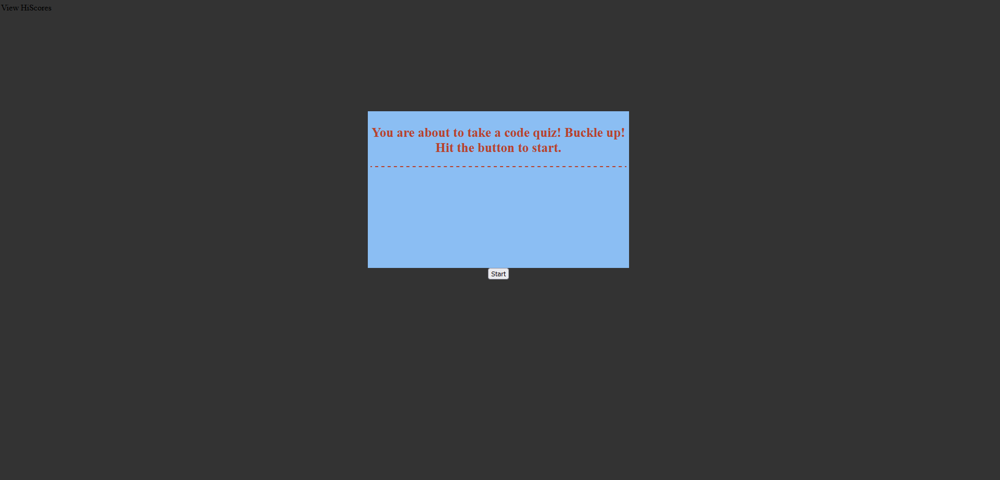

# code-quiz
* This site allows you to take a short, timed quiz about simple JavaScript concepts/definitions. It takes your answer as what you click on. Wrong answers subtract from your remaining time. The score you are given at the end is equal to your remaining time. It allows you to make an entry (asks for initials) and attach it to your score for that round, saving the results into your machine's local storage. You can view the hiScores list by hovering over the 'View HiScores' in the upper-left hand corner.

https://b-e-christensen.github.io/code-quiz/
